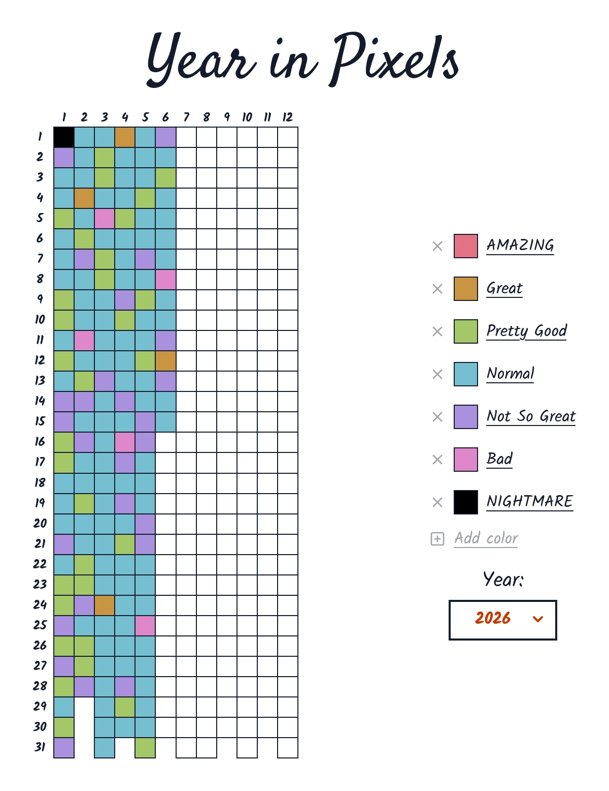

# Year in Pixels



An online journaling tool that uses colors to track your feelings throughout the year. It lets you condense an entire day into a single pixel. By the end of the year, you get a vibrant grid summarizing your entire year.

## Features

- Usable straight away on any device that can access the internet.
- Fully customizable color scheme to track anything you want.
- Multi-year support.
- Fill in a pixel each day that best represents your activity or mood for that day.
- Export as PNG and JSON, and import a JSON file.
- Autosave to `localstorage` with `navigator.storage.persist` API.

## Tech Stack

- Frontend: Svelte 5
- Styling: TailwindCSS
- Language: TypeScript
- UI Icons: Lucide
- Other Utilities: html-to-image
- Code Formatting: Prettier + prettier-plugin-svelte + prettier-plugin-tailwindcss
- Build System: Vite

## Running locally

These instructions will get you a copy of the project up and running on your local machine.

### Prerequisites

Before running or developing this project, ensure the following are installed:

- Node.js: 20.19.0 or higher (recommended: Node 22 LTS)
- Package manager: npm, pnpm, or yarn
- Git: for cloning the repository

### Installing

1. Clone the repository:
   ```bash
   git clone https://github.com/Lihu0/YearInPixels.git
   ```
2. Navigate into the project directory:
   ```bash
   cd YearInPixels
   ```
3. Install dependencies:
   ```bash
   npm install # npm
   pnpm install # pnpm
   yarn install # yarn
   ```

### Local Development

Run the website locally with Vite:

```bash
npm run dev
```

Open your browser and navigate to `localhost:5173` (or the port specified in your terminal) to view the site.

## Licensing

This project is licensed under the MIT license. See [LICENSE](LICENSE) for more information.
